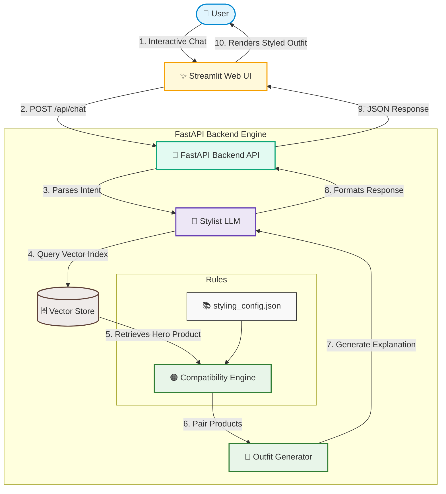

# 👔 DarexAI: Production-Grade AI Fashion Stylist & Recommendation Assistant

[](https://opensource.org/licenses/MIT)
[](https://fastapi.tiangolo.com)
[](https://streamlit.io)
[](https://www.python.org/)
[](https://www.docker.com/)

DarexAI is a decoupled, production-ready fashion styling and recommendation system. It leverages multi-modal vision-language models (CLIP), hybrid similarity vector search, and Large Language Models (Gemini) to deliver cohesive, context-aware outfit recommendations with personalized styling rationales.

---

## 🗺️ System Architecture

The recommendation engine is built on a modular pipeline combining semantic vision-text search and rule-based styling logic, decoupled into a separate frontend and API backend service:



### Core Architecture Components

*   **Frontend Service (`app.py`)**: A premium Streamlit dashboard that implements a responsive chat UI, filter configurations (such as gender and occasion overrides), and renders recommendation cards.
*   **Backend Service (`main.py`)**: A high-throughput FastAPI application exposing REST endpoints for chat interaction, index rebuilding, and system health checks.
*   **Vector Database & Embedding Store (`vector_store.py`)**: A high-dimensional similarity index using pre-computed CLIP features with runtime metadata filtering.
*   **Stylist Agent (`assistant.py`)**: Powered by the Gemini API. Acts as the brain, performing semantic query parsing, generating human-like styling rationales, and executing out-of-catalog search validations.
*   **Compatibility Engine (`compatibility.py`)**: Runs rule-based expert heuristics configured via `styling_config.json` to map matching companion items.

---

## 🧠 ML Design & Retrieval Mechanics (Deep Dive)

### 1. Hybrid Search Formulation
Pure text search can fall victim to domain-specific jargon mismatch, while pure visual search lacks the ability to filter on descriptive metadata. DarexAI implements a **Hybrid Semantic Embeddings** approach by linearly blending normalized image and text representations from the **CLIP (ViT-B/32)** model:

$$\vec{E}_{\text{hybrid}} = \text{L2-Normalize}\left(\alpha \cdot \vec{E}_{\text{vision}} + (1 - \alpha) \cdot \vec{E}_{\text{text}}\right)$$

*   **Optimal Blending Weight ($\alpha = 0.05$):** Our benchmark evaluation shows that assigning $95\%$ weight to the descriptive text embedding and $5\%$ to the visual image embedding achieves the highest Mean Reciprocal Rank (MRR). The tiny visual embedding acts as a regularizer/grounding signal that anchors the textual descriptions to actual visual characteristics (colors, shapes), optimizing retrieval accuracy.
*   **CLIP-Specific Prompt Engineering:** Rather than passing raw metadata strings to the model, descriptions are compiled using structured templates to match CLIP's pre-training distribution:
    > *"A studio catalog photograph of a [Brand] [Category] in a [Occasion] style. Details: [Product Description text]"*

### 2. Lazy Model Loading & Concurrent Thread Safety
To optimize startup times and conserve system memory, the CLIP model and processor are lazy-loaded on the first API request. Because FastAPI processes requests concurrently, a reentrant thread lock (`threading.RLock`) protects the model initialization block:

```python
_lock = threading.RLock()

def get_model_and_processor():
    global _model, _processor
    if _model is None or _processor is None:
        with _lock:
            if _model is None or _processor is None:
                _model = CLIPModel.from_pretrained(config.CLIP_MODEL_NAME).to(config.device)
                _processor = CLIPProcessor.from_pretrained(config.CLIP_MODEL_NAME)
                _model.eval()
    return _model, _processor
```

### 3. Out-of-Catalog Query Validation
When a user asks for items not present in the database (e.g., *"I need a neon pink trench coat"*), standard vector searches will still return the closest mathematical match (e.g., a standard pink hoodie). To prevent false positives, DarexAI runs a **Dual-Stage Out-of-Catalog Validation** pipeline:
1. **Semantic Fetch:** The vector store retrieves the top-ranked item matching the query.
2. **LLM Validation:** The user's query and the retrieved item's metadata are passed to the Gemini LLM. The LLM evaluates if the catalog item is a true match or a fallback substitute.
3. **Graceful Fallback:** If evaluated as a fallback, the LLM adapts the styling explanation to politely explain that the exact item is out-of-catalog and explains why the recommended alternative is a great substitute.

---

## 🗄️ Configuration-Driven Styling Rules
Styling rules and category relationships are completely decoupled from code logic, allowing stylist teams to tweak recommendations via [src/styling_config.json](file:///c:/Books/DarexAI/src/styling_config.json).

### Configuration Schema
```json
{
  "category_groups": {
    "topwear": ["topwear", "kurtas", "shirts", "tshirts", "blazers"],
    "bottomwear": ["bottomwear", "pants", "trousers", "jeans", "skirts", "shorts"],
    "footwear": ["footwear", "shoes", "sneakers", "sandals", "heels", "flats"],
    "one_piece": ["dresses", "sarees", "jumpsuits"],
    "accessory": ["accessories", "bags", "watches", "sunglasses", "belts"]
  },
  "matching_rules": {
    "topwear": ["bottomwear", "footwear", "accessory"],
    "one_piece": ["footwear", "accessory"],
    "bottomwear": ["topwear", "footwear", "accessory"],
    "footwear": ["topwear", "bottomwear", "accessory"]
  }
}
```

---

## 🔌 API Reference & Data Contracts

FastAPI automatically hosts interactive OpenAPI documentation at `/docs`. Below are the primary service contracts:

### 1. `POST /api/chat`
Performs conversational parsing, retrieves the hero product, matches companion items, and returns the curated outfit.

*   **Request Payload (`ChatRequest`):**
    ```json
    {
      "message": "I need a formal outfit for a presentation",
      "gender_override": "Male",
      "occasion_override": "Formal"
    }
    ```
*   **Response Payload (`ChatResponse`):**
    ```json
    {
      "content": "Based on your request, I've curated a styled outfit starting with a primary hero item...",
      "outfit": {
        "source": "database_fallback_or_rule",
        "outfit_id": "outfit_4821",
        "theme": "Business Formal",
        "palette": "Navy Blue, Dark Grey, Brown",
        "stylist_rationale": "Beige chinos pair well with a navy blazer because...",
        "items": {
          "hero": { "id": "1001", "name": "Navy Blue Blazer", "brand": "BrandX", "price_inr": 4999.0 },
          "companion_1": { "id": "2005", "name": "Slim Fit Dress Pants", "brand": "BrandY", "price_inr": 2499.0 }
        }
      }
    }
    ```

### 2. `GET /health`
Exposes container health, PyTorch CUDA capability status, embeddings cache existence, and API key connectivity.
*   **Response Payload:**
    ```json
    {
      "status": "healthy",
      "pytorch_device": "cuda",
      "embeddings_cached": true,
      "gemini_api_key_connected": true,
      "total_products": 68,
      "total_outfits": 25
    }
    ```

### 3. `POST /api/rebuild-index`
Flushes the embeddings cache file and regenerates image and text embeddings across the entire catalog.

---

## 📂 Project Structure

```text
DarexAI/
├── src/                        # Main Application Code
│   ├── app.py                  # Streamlit Web App Interface (Frontend)
│   ├── main.py                 # FastAPI Backend Server Application (Backend)
│   ├── assistant.py            # Stylist Agent Orchestration (Gemini LLM)
│   ├── compatibility.py        # Styling Rules & Matchmaker Engine
│   ├── config.py               # Constants, Paths & Hyperparameters
│   ├── data_loader.py          # Catalog Preprocessing & Sanitization
│   ├── download_models.py      # Pre-download weights for offline/container caching
│   ├── embedder.py             # CLIP Embedding Extraction
│   ├── styling_config.json     # Configuration file for categories & match rules
│   └── vector_store.py         # Vector Indexing & Hybrid Retrieval
│
├── tests/                      # Testing Suite (Unit & Integration Tests)
│   ├── test_api.py             # Integration tests for FastAPI endpoints
│   ├── test_assistant.py
│   ├── test_compatibility.py
│   ├── test_data_loader.py
│   ├── test_embedder.py
│   └── test_vector_store.py
│
├── ML-TASK/                    # Catalog Dataset (Provided CSVs & Images)
│   ├── products.csv            # Catalog items
│   ├── outfits.csv             # Human expert styled outfits
│   └── images/                 # Catalog product images
│
├── Dockerfile                  # Single-container multi-target build
└── docker-compose.yml          # Container configuration with volume cache mounting
```

---

## 🚀 Getting Started

### 📋 Prerequisites
- Python 3.10 or higher
- Docker and Docker Compose (Optional, for containerized execution)
- A **Gemini API Key** (Set as environment variable `GEMINI_API_KEY`)

### 🛠️ Local Installation & Development
1. **Clone the repository**:
   ```bash
   git clone <your-repository-url>
   cd DarexAI
   ```

2. **Set up a virtual environment and install dependencies**:
   ```bash
   python -m venv .venv
   # Windows (PowerShell)
   .venv\Scripts\Activate.ps1
   # macOS/Linux
   source .venv/bin/activate
   
   pip install -r pyproject.toml
   ```

3. **Configure Environment Variables**:
   Create a `.env` file in the root directory:
   ```env
   GEMINI_API_KEY=your_gemini_api_key_here
   ```

4. **Launch the Application**:
   Open two separate terminal windows with active virtual environments:
   *   **Terminal 1 (Backend):**
       ```bash
       python -m uvicorn src.main:app --reload --port 8000
       ```
   *   **Terminal 2 (Frontend):**
       ```bash
       python -m streamlit run src/app.py
       ```
   Open `http://localhost:8501` to use the Streamlit interface.

---

## 🐳 Docker Deployment
You can deploy the complete app with automatic Hugging Face model weight volume caching to avoid network bottlenecks on container restart:

```bash
docker-compose up --build
```

---

## 🧪 Testing Suite
We maintain **18 integration and unit tests** asserting the correctness of the embedding layer, semantic index filtering, styling rules, and API endpoints.

To execute tests with verbose logs:
```bash
pytest -v
```

---

## 📊 Model Evaluation & Benchmarks

The system similarity metrics are validated against **25 expert-curated outfits** (ground-truth). We measure search performance using:
*   **Hit Rate @ 1**: If the expert companion item is the top-ranked recommendation.
*   **Hit Rate @ 3**: If the expert companion item is in the top three recommendations.
*   **Mean Reciprocal Rank (MRR)**: A position-weighted rank score, defined as:

$$\text{MRR} = \frac{1}{|Q|} \sum_{i=1}^{|Q|} \frac{1}{\text{rank}_i}$$

### Quantitative Results
| Search Configuration | Mean Reciprocal Rank (MRR) | Hit Rate @ 1 | Hit Rate @ 3 |
| :--- | :---: | :---: | :---: |
| Random Baseline | 0.4160 | 18.85% | 53.39% |
| Text-Only CLIP | 0.6108 | 39.68% | 79.37% |
| **Hybrid CLIP ($\alpha=0.05$)** | **0.6245** | **41.27%** | **79.37%** |

To run the evaluation script yourself, run:
```bash
python workbooks/eval_metrics.py
```

---

## 📈 Enterprise Scale-Out Roadmap
For production environments with catalogs exceeding $10^5$ items, the current in-memory NumPy cosine similarity search ($O(N)$ linear complexity) becomes a bottleneck. The proposed enterprise scale-out architecture includes:

1. **Hierarchical Navigable Small World (HNSW) Indexing:** Transition from linear scan to sub-linear logarithmic search $O(\log N)$ by integrating **FAISS** or **scann**.
2. **Managed Vector Database:** Migrate vectors and product metadata into a specialized database such as **Qdrant** or **Milvus**, allowing pre-filtering indexes (e.g., gender, occasion) before vector distance computation.
3. **Distributed Model Serving:** Decouple CLIP embedding generation by running a dedicated embedding service using **Triton Inference Server** or **TorchServe**, separating scaling rules for vision/text inference from web server execution.
