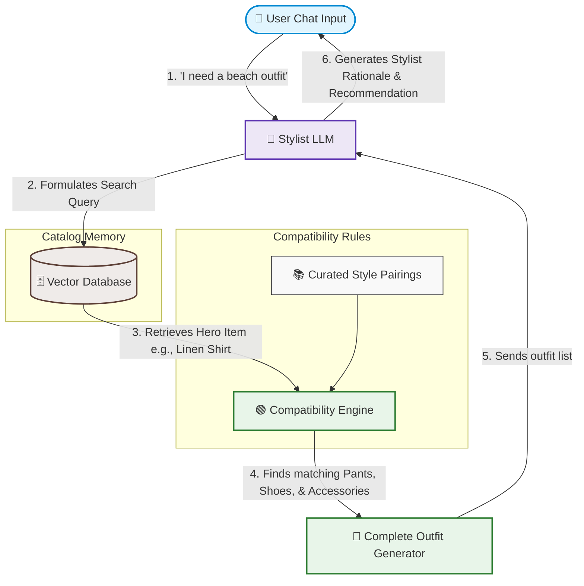

# DarexAI: AI Fashion Stylist & Recommendation Assistant

An AI-powered fashion styling assistant using CLIP embeddings, vector search, and LLMs to provide curated outfit recommendations. Features a premium Streamlit interface, robust unit testing, and Docker deployment. Delivers personalized styling rationale with intelligent out-of-catalog request handling.

---

## 🗺️ System Architecture

The recommendation engine is built on a modular pipeline combining semantic vision-text search and rule-based styling logic:



### Core Components
*   **The Brain (Stylist LLM)**: Powered by Gemini. Analyzes user messages, determines styling rules, performs intent mapping, validates product match relevance, and explains styling decisions.
*   **The Eyes (CLIP Model)**: Generates high-dimensional image/text embeddings, enabling visual-semantic retrieval from the fashion catalog.
*   **The Memory (Vector Store)**: Indexes, caches, and filters catalog embeddings (by gender, category, and similarity) for sub-millisecond retrieval.
*   **The Matchmaker (Compatibility Engine)**: Uses rule-based logic derived from 25 expert-curated outfits to assemble matching items (topwear, bottomwear, footwear, accessories) based on the "Hero" item retrieved.
*   **Configuration-Driven Styling Rules (`styling_config.json`)**: Decouples category mappings and compatibility pairing lists into an external JSON file, enabling code-free styling modifications.
*   **Pre-cached Model Loader (`download_models.py`)**: Warm-starts the application by pre-downloading CLIP model weights during Docker builds, preventing runtime container launch delays.

---

## 📂 Project Structure

```text
DarexAI/
├── src/                        # Main Application Code
│   ├── app.py                  # Streamlit Web App Interface
│   ├── assistant.py            # Stylist Agent Orchestration (Gemini LLM)
│   ├── compatibility.py        # Styling Rules & Matchmaker Engine
│   ├── config.py               # Constants, Paths & Hyperparameters
│   ├── data_loader.py          # Catalog Preprocessing & Sanitization
│   ├── download_models.py      # Pre-download weights for offline/container caching
│   ├── embedder.py             # CLIP Embedding Extraction
│   ├── styling_config.json     # Configuration file for categories & match rules
│   └── vector_store.py         # Vector Indexing & Hybrid Retrieval
│
├── tests/                      # Testing Suite (18 Unit & Integration Tests)
│   ├── test_assistant.py
│   ├── test_compatibility.py
│   ├── test_data_loader.py
│   ├── test_embedder.py
│   └── test_vector_store.py
│
├── ML-TASK/                    # Catalog Dataset (Provided CSVs & Images)
│   ├── products.csv            # 68 catalog items
│   ├── outfits.csv             # 25 expert combinations
│   └── images/                 # Catalog product images
│
├── workbooks/
│   └── Notebook.ipynb          # Exploratory Data Analysis & Validation
│
├── Dockerfile                  # Single-container application build
└── docker-compose.yml          # Container configuration with volume cache mounting
```


---

## 🚀 Getting Started

### 📋 Prerequisites
- Python 3.10 or higher
- A **Gemini API Key** (optional, fallback offline mode is supported automatically)

### 🛠️ Local Setup
1. **Clone the repository**:
   ```bash
   git clone <your-repository-url>
   cd DarexAI
   ```

2. **Set up a virtual environment and install dependencies**:
   ```bash
   python -m venv .venv
   .venv\Scripts\activate      # Windows
   source .venv/bin/activate    # macOS/Linux
   pip install -r pyproject.toml  # or use uv / pip install .
   ```

3. **Configure Environment Variables**:
   Create a `.env` file in the root directory (this is automatically ignored by Git):
   ```env
   GEMINI_API_KEY=your_gemini_api_key_here
   ```

4. **Launch the Application**:
   ```bash
   streamlit run src/app.py
   ```
   Open `http://localhost:8501` in your browser.

---

## 🐳 Docker Deployment
Run the entire application in a container with persistent model and embedding caching:

```bash
# Start container
docker-compose up --build
```
The Streamlit app will be available on `http://localhost:8501`.

---

## 🧪 Running Automated Tests
The repository includes a comprehensive suite of **18 tests** validating data integrity, semantic retrieval boundaries, and conversational logic.

To run the tests:
```bash
pytest -v
```

---

## 📊 Model Evaluation & Benchmarks

To mathematically guarantee search quality, the system is benchmarked against the **25 expert-curated outfits** (ground-truth).

### The Process from First Principles
1. **The Question**: If a user is recommended a primary "Hero" item (like a Navy Suit), how well can our vector database find the exact matching shoes, shirt, and accessories styled by human fashion experts?
2. **The Test**: For each curated outfit, we generate search queries based on the Hero item and measure the rank (position) of the human-curated companions in the database search results.
3. **The Metrics**:
   * **Hit Rate @ 1**: Did the exact expert-chosen companion rank #1?
   * **Hit Rate @ 3**: Did it rank in the top 3 (making it visible side-by-side on the screen)?
   * **MRR (Mean Reciprocal Rank)**: A score between `0` and `1` that averages $1/\text{position}$ of the correct item. The closer to `1.0`, the closer correct recommendations are to the top.

### Quantitative Benchmark Results

Our model is optimized using **CLIP-Specific Prompt Engineering** and **Weighted Blending ($\alpha=0.05$** visual weight, **$95\%$** text weight):

| Model / Search Engine | Mean Reciprocal Rank (MRR) | Hit Rate @ 1 | Hit Rate @ 3 |
| :--- | :---: | :---: | :---: |
| **Random Baseline** | 0.4160 | 18.85% | 53.39% |
| **Text-Only CLIP** | 0.6108 | 39.68% | 79.37% |
| **Hybrid CLIP (Optimal $\alpha=0.05$)** | **0.6245** | **41.27%** | **79.37%** |

*Our optimized Hybrid Model puts the exact expert styling companion in the top-3 results in **nearly 80%** of all styling requests!*

### Running the Evaluation
To run the evaluation script and calculate these benchmarks yourself, run:
```bash
python workbooks/eval_metrics.py
```
